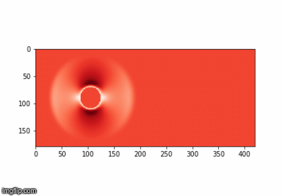

# Installation

```bash

pip install -r requirements.txt

```

# Lattice Boltzmann Method




# Design of Experiments

```python

def generate_random_experiments(num, criterion='center'):
    experiments = [pyDOE2.lhs(MNIST_DIMENSION, samples=MNIST_DIMENSION, criterion=criterion) for i in range(num)]
    return experiments

def generate_flow(experiments, ground_truth, num_experiments):
    return [experiments[i]*(experiments[i] - ground_truth) for i in range(num_experiments)]

```


# Execute the DOE transitions

```bash

python experiment.py -d mnist -fs 5 -fi 0 -ts 7 -ti 0 -n 100 -m center

```
